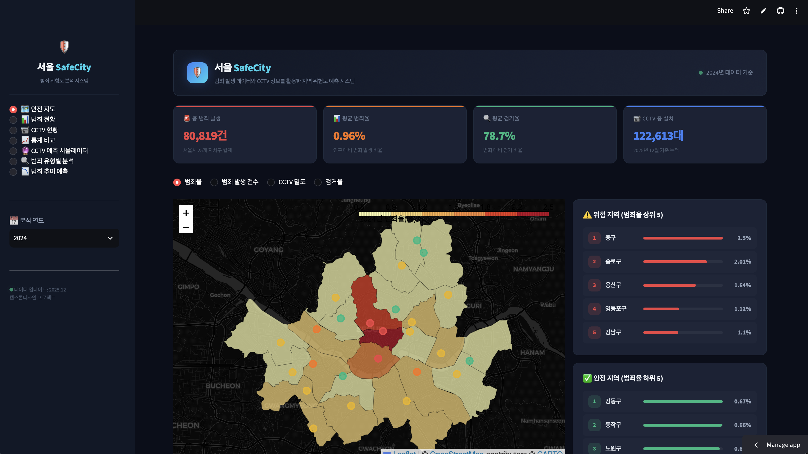
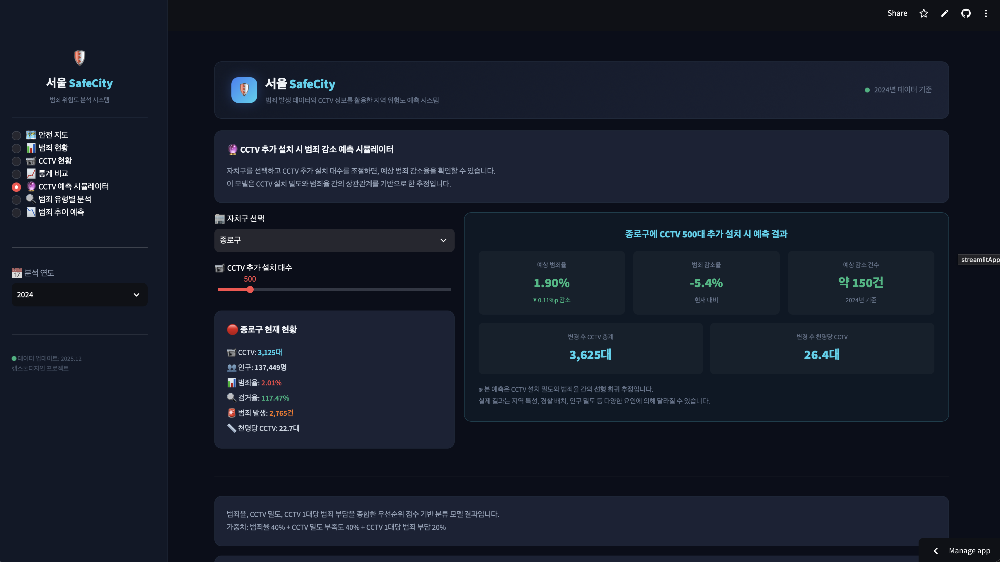
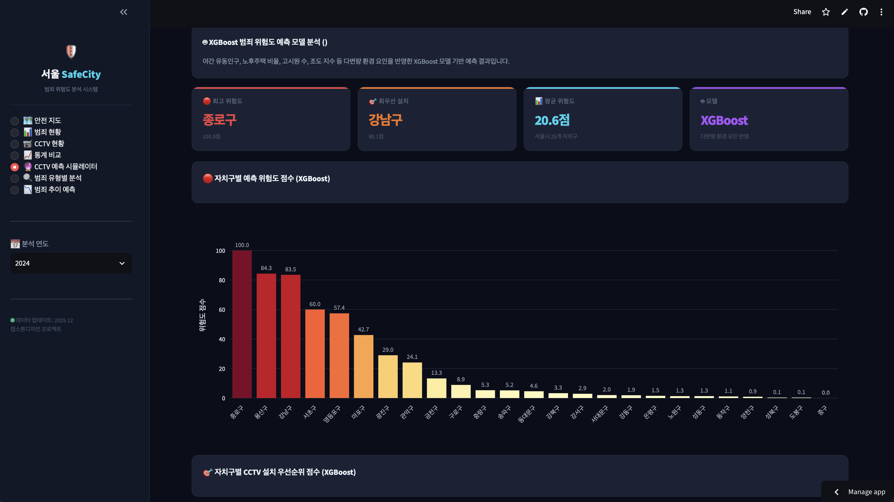

Seoul SafeCity — 犯罪リスク分析システム
犯罪発生データ、CCTV設置状況、人口データを統合し、ソウル市25区の犯罪リスクを分析するとともに、CCTV追加設置の優先順位をシミュレーションするStreamlitベースのダッシュボードです。

本リポジトリ(2026-1/seoulcrime202601)はキャップストーンデザイン(卒業設計)チームプロジェクトの成果物であり、上位リポジトリの他のフォルダ(Etc、ver20121210などの行政洞境界地図アーカイブ)は別の長期運営プロジェクトであり、本プロジェクトとは無関係です。

🗺️ 安全マップ — 区別リスクレベルとCCTV密度を可視化

🔮 CCTV追加設置シミュレーター — 追加設置台数に応じた犯罪減少率予測

🤖 ML/XGBoostベースのCCTV設置優先順位分析

1. 課題定義
ソウル市の犯罪発生データとCCTV設置状況はそれぞれ異なる機関から公開されており、両データを紐づけて「どの地域にCCTVを追加設置すれば犯罪抑止効果が最大化するか」を総合的に判断することが困難でした。単純に犯罪率が高い地域にCCTVを増設する方式では、すでにCCTVが十分に設置されている地域と実際に不足している地域を区別できないという限界があります。

本プロジェクトは、犯罪・CCTV・人口・面積データを一つのダッシュボードに統合し、ルールベース指標と機械学習モデルを組み合わせてCCTV追加設置の優先順位を定量的に提示することを目的としています。

2. チーム構成と担当範囲
キャップストーンデザインの3人チームプロジェクトとして、以下のように担当範囲を分担しました。

担当者	役割
ハン・ユンス(한윤수)	Streamlitダッシュボードの企画、多変量環境要因に基づく犯罪リスク予測モデル(XGBoost)、XGBoost結果可視化ページ(リスク・優先順位チャート、地図、詳細テーブル)のコード作成
チョ・ヒョンジ(조현지)	犯罪・CCTV・人口・面積データのクリーニング・統合、Streamlitダッシュボード全体の設計・実装
ファン・ジュンヨン(황준연)	CCTV追加設置優先順位分類モデル(Decision Tree / Random Forest)
3. データ
crime_seoul.csv、Seoul_Crime_Model_Data.csv、자치구별 범죄율 검거율 5개년.csv、전국 발생 검거 수.csv: 区別犯罪発生・検挙データ(2019〜2024年)

cctv_seoul.csv、cctv_clean.csv、cctv_new.csv: 区別CCTV設置状況(2016〜2025年)

population_seoul.csv、인구 수.csv: 区別人口データ

area_seoul.csv: 区別面積(km²)

cctv_model_result_revised.csv: ファン・ジュンヨン担当の優先順位分類モデル結果

xgb_crime_model.json: ハン・ユンス担当のXGBoostリスク予測モデル

4. 使用技術スタック
言語/フレームワーク: Python、Streamlit

データ処理: Pandas、NumPy

可視化: Plotly Express/Graph Objects、Folium(HeatMap、Choropleth、CircleMarker)

機械学習: XGBoost、scikit-learn(Decision Tree、Random Forest、MinMaxScaler)

その他: requests(公共GeoJSONデータの取得)

5. ダッシュボード構成
総合状況: 総犯罪発生件数、平均犯罪率、平均検挙率、CCTV総設置台数などの主要KPIと危険/安全地域トップ5

CCTV設置状況分析: 区別CCTV設置台数・推移、人口1,000人当たり設置比率、設置状況マップ、面積当たり設置/犯罪密度

区別比較: 最大5区を選択して犯罪・CCTV指標を比較、CCTV台数と犯罪率の相関分析

CCTV追加設置シミュレーター: 区とCCTV追加設置台数を調整すると、CCTV密度-犯罪率の回帰推定に基づいて予想犯罪減少率を算出

ML(機械学習)ベースの優先順位分析(ファン・ジュンヨン): 犯罪率40% + CCTV密度不足度40% + CCTV1台当たり犯罪負担20%を加重した優先順位スコア、Decision Tree/Random Forestの精度比較

XGBoostリスク予測(ハン・ユンス): 夜間流動人口、老朽住宅比率、簡易宿泊所数、照度指数などの環境要因を反映した区別リスクスコアおよび設置優先順位

5大犯罪類型別分析: 殺人・強盗・強姦・強制わいせつ・窃盗などの類型別発生・検挙状況

推移予測: 区別犯罪率・検挙率の年度別推移および2025〜2026年予測

6. モデル性能
モデル	用途	精度
Decision Tree / Random Forest	CCTV追加設置優先順位分類	85.7%
SVM	〃	71.4%
KNN	〃	57.1%
中区(중구)は人口比犯罪率が最も高いものの、CCTV密度も高いため最上位の優先順位からは除外された。

松坡区(송파구)は犯罪率が平均以上でありながらCCTV密度が低く、優先順位が最上位に算出された。

7. 今後の課題
企画初期段階にあったAI深層分析(Gemini API連携)機能は、無料APIの政策変更により除外しました。今後、有料APIまたはオープンソースLLMに置き換えて再導入する予定です。

道路名住所地図など最新の行政境界データへの地図ソース切り替え

夜間流動人口などの環境変数データの最新化によるXGBoostモデルの精緻化

区単位よりも細分化された行政洞単位の分析への拡張

8. フォルダ構成
text
seoulcrime202601/
├── README.md
├── app.py                              # Streamlitメインダッシュボード
├── requirements.txt
├── images/                             # READMEスクリーンショット
│   ├── 1.png
│   ├── 2.png
│   └── 3.png
├── crime_seoul.csv                     # 区別犯罪発生/検挙(2024年)
├── Seoul_Crime_Model_Data.csv
├── 자치구별 범죄율 검거율 5개년.csv
├── 전국 발생 검거 수.csv
├── cctv_seoul.csv / cctv_clean.csv / cctv_new.csv   # CCTV設置状況
├── population_seoul.csv / 인구 수.csv  # 人口データ
├── area_seoul.csv                      # 区別面積
├── cctv_model_result_revised.csv       # 優先順位分類モデル結果(ファン・ジュンヨン)
├── xgb_crime_model.json                # XGBoostリスクモデル(ハン・ユンス)
├── test_data.py / test_map.py / seoul_map_test.html  # 開発中のテストスクリプト
9. 実行方法
bash
pip install -r requirements.txt
streamlit run app.py
서울 SafeCity — 범죄 위험도 분석 시스템
범죄 발생 데이터, CCTV 설치 현황, 인구 데이터를 통합하여 서울시 25개 자치구의 범죄 위험도를 분석하고, CCTV 추가 설치 우선순위를 시뮬레이션하는 Streamlit 기반 대시보드입니다.

본 리포지토리(2026-1/seoulcrime202601)는 캡스톤디자인 팀 프로젝트 결과물이며, 상위 리포지토리의 다른 폴더(Etc, ver20121210 등 행정동 경계 지도 아카이브)는 별도의 장기 운영 프로젝트로 본 프로젝트와 무관합니다.

🗺️ 안전 지도 — 자치구별 위험도와 CCTV 밀도를 시각화

🔮 CCTV 추가 설치 시뮬레이터 — 추가 설치 대수에 따른 범죄 감소율 예측

🤖 ML/XGBoost 기반 CCTV 설치 우선순위 분석

1. 문제 정의
서울시의 범죄 발생 데이터와 CCTV 설치 현황은 각각 다른 기관에서 공개되어, 두 데이터를 연결해 "어느 지역에 CCTV를 추가로 설치해야 범죄 예방 효과가 가장 큰가"를 종합적으로 판단하기 어렵습니다. 단순히 범죄율이 높은 지역에 CCTV를 늘리는 방식은, 이미 CCTV가 충분히 설치된 지역과 실제로 CCTV가 부족한 지역을 구분하지 못한다는 한계가 있습니다.

본 프로젝트는 범죄·CCTV·인구·면적 데이터를 하나의 대시보드로 통합하고, 규칙 기반 지표와 머신러닝 모델을 함께 활용해 CCTV 추가 설치 우선순위를 정량적으로 제시하는 것을 목표로 합니다.

2. 팀 구성 및 담당 역할
캡스톤디자인 3인 팀 프로젝트로, 담당 영역을 아래와 같이 분담했습니다.

담당자	역할
한윤수	Streamlit 대시보드 기획, 다변량 환경 요인 기반 범죄 위험도 예측 모델(XGBoost), XGBoost 결과 시각화 페이지(위험도·우선순위 차트, 지도, 상세 테이블) 코드 작성
조현지	범죄·CCTV·인구·면적 데이터 정제·병합, Streamlit 대시보드 전체 설계·구현
황준연	CCTV 추가 설치 우선순위 분류 모델 (Decision Tree / Random Forest)
3. 데이터
crime_seoul.csv, Seoul_Crime_Model_Data.csv, 자치구별 범죄율 검거율 5개년.csv, 전국 발생 검거 수.csv: 자치구별 범죄 발생·검거 데이터(2019~2024)

cctv_seoul.csv, cctv_clean.csv, cctv_new.csv: 자치구별 CCTV 설치 현황(2016~2025)

population_seoul.csv, 인구 수.csv: 자치구별 인구 데이터

area_seoul.csv: 자치구별 면적(km²)

cctv_model_result_revised.csv: 황준연 담당 우선순위 분류 모델 결과

xgb_crime_model.json: 한윤수 담당 XGBoost 위험도 예측 모델

4. 사용 기술 스택
언어/프레임워크: Python, Streamlit

데이터 처리: Pandas, NumPy

시각화: Plotly Express/Graph Objects, Folium(HeatMap, Choropleth, CircleMarker)

머신러닝: XGBoost, scikit-learn(Decision Tree, Random Forest, MinMaxScaler)

기타: requests(공공 GeoJSON 데이터 로드)

5. 대시보드 구성
종합 현황: 총 범죄 발생, 평균 범죄율, 평균 검거율, CCTV 총 설치 대수 등 핵심 KPI와 위험/안전 지역 Top 5

CCTV 현황 분석: 자치구별 CCTV 설치 대수·추이, 인구 1,000명당 설치 비율, 설치 현황 지도, 면적당 설치/범죄 밀도

자치구 비교: 최대 5개 자치구를 선택해 범죄·CCTV 지표를 비교, CCTV 대수와 범죄율의 상관관계 분석

CCTV 추가 설치 시뮬레이터: 자치구와 추가 설치 대수를 조절하면 CCTV 밀도-범죄율 회귀 추정 기반으로 예상 범죄 감소율을 계산

ML 기반 우선순위 분석(황준연): 범죄율 40% + CCTV 밀도 부족도 40% + CCTV 1대당 범죄 부담 20%로 가중한 우선순위 점수, Decision Tree/Random Forest 정확도 비교

XGBoost 위험도 예측(한윤수): 야간 유동인구, 노후주택 비율, 고시원 수, 조도 지수 등 환경 요인을 반영한 자치구별 위험도 점수 및 설치 우선순위

5대 범죄 유형별 분석: 살인·강도·강간·강제추행·절도 등 유형별 발생·검거 현황

추이 예측: 자치구별 범죄율·검거율 연도별 추이 및 2025~2026년 예측

6. 모델 성능
모델	용도	정확도
Decision Tree / Random Forest	CCTV 추가 설치 우선순위 분류	85.7%
SVM	〃	71.4%
KNN	〃	57.1%
중구는 인구 대비 범죄율이 가장 높지만 CCTV 밀도 역시 높아 최상위 우선순위에서 제외됨.

송파구는 범죄율이 평균 이상이면서 CCTV 밀도가 낮아 우선순위 최상위로 산출됨.

7. 향후 과제
초기 기획 단계에 있었던 AI 심층분석(Gemini API 연동) 기능은 무료 API 정책 변경으로 제외했습니다. 향후 유료 API 또는 오픈소스 LLM으로 대체해 재도입할 계획입니다.

도로명주소지도 등 최신 행정경계 데이터로의 지도 소스 교체

야간 유동인구 등 환경 변수 데이터 최신화를 통한 XGBoost 모델 정교화

자치구 단위보다 세분화된 행정동 단위 분석으로 확장

8. 폴더 구조
text
seoulcrime202601/
├── README.md
├── app.py                              # Streamlit 메인 대시보드
├── requirements.txt
├── images/                             # README 스크린샷
│   ├── 1.png
│   ├── 2.png
│   └── 3.png
├── crime_seoul.csv                     # 자치구별 범죄 발생/검거(2024)
├── Seoul_Crime_Model_Data.csv
├── 자치구별 범죄율 검거율 5개년.csv
├── 전국 발생 검거 수.csv
├── cctv_seoul.csv / cctv_clean.csv / cctv_new.csv   # CCTV 설치 현황
├── population_seoul.csv / 인구 수.csv  # 인구 데이터
├── area_seoul.csv                      # 자치구별 면적
├── cctv_model_result_revised.csv       # 우선순위 분류 모델 결과 (황준연)
├── xgb_crime_model.json                # XGBoost 위험도 모델 (한윤수)
├── test_data.py / test_map.py / seoul_map_test.html  # 개발 중 테스트 스크립트
9. 실행 방법
bash
pip install -r requirements.txt
streamlit run app.py
